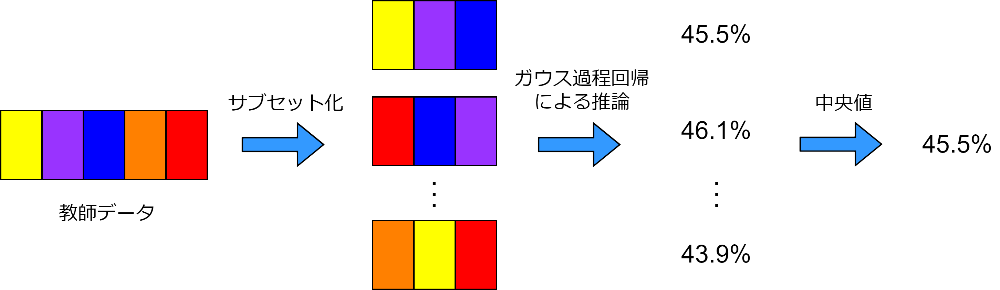
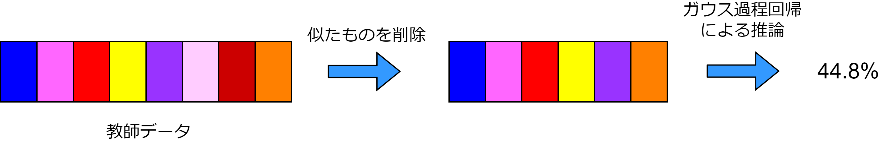

# UndergraduateResearch
卒業研究の実験のために書いたソースコードです。 
全てのコードを1から書きました。 
(自動生成されるコードである[cython_wl_kernel.cpp](cython_wl_kernel.cpp)を除く)

論文[Neural Architecture Search using Bayesian Optimisation with Weisfeiler-Lehman Kernel](https://arxiv.org/abs/2006.07556v1)をベースとしています。

卒業論文は[こちら](https://drive.google.com/file/d/1C9roMHSPTDO5KhsnYaoSr7gMs4ZYpqzj/view)

# 実行環境
- CentOS 7.7-1908
- Python 3.6.8
- GCC 4.8.5

# 必要なモジュール
- Cython
- numpy 
- matplotlib
- yaml
- requests
- nats_bench
- tqdm

# ソースコードの説明
|ファイル名|内容|
|-|-|
|[auto_submit.py](auto_submit.py)|SLURMを対象としてジョブを自動で投入する|
|[kernel_time.py](kernel_time.py)|WLカーネルの実行時間テスト用|
|[nasbowl2.py](nasbowl2.py)|メインプログラム|
|[slack_bot.py](slack_bot.py)|Webhookを用いてSlackにプログラムの実行状況を自動送信する(WebhookのURLは非公開)|
|[util.py](util.py)|共通で用いるクラスや関数|
|[cython_setup.py](cython_setup.py)|[Cython実装のWLカーネル](cython_wl_kernel.pyx)と[C++実装のWLカーネル](wl_kernel.cpp)をPython向けにコンパイルする|
|[make_kernel_cache.py](make_kernel_cache.py)|WLカーネルの値をキャッシュとしてファイルに保存する|
|[old.py](old.py)|過去に用いていた関数などの置き場|
|[test.py](test.py)|プログラムの実行結果の可視化など|
|[view_commands.py](view_commands.py)|過去に実行したプログラムのパラメータを一覧表示|
|[cython_wl_kernel.cpp](cython_wl_kernel.cpp)|Cythonによって自動生成されたWLカーネルのC++プログラム|
|[cython_wl_kernel.pyx](cython_wl_kernel.pyx)|WLカーネルのCython実装|
|[wl_kernel.cpp](wl_kernel.cpp)|WLカーネルのC++実装|
|[wl_kernel.hpp](wl_kernel.hpp)|[wl_kernel.cpp](wl_kernel.cpp)に対応するヘッダファイル|

# 実行例
`python3 nasbowl2.py srcc -T 1500 --trials 10 --k_size_max 400 --eval_freq 10 --name sample`

